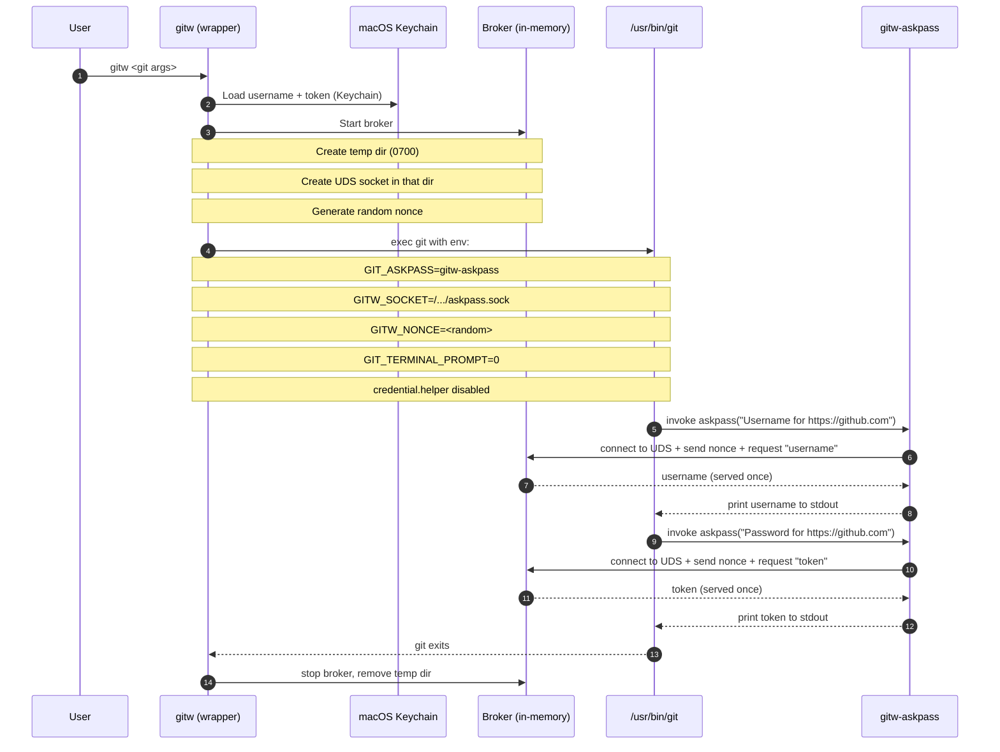

# gitw

`gitw` is a **secure Git wrapper for macOS** that:

- Only allows **GitHub HTTPS** remotes (`https://github.com/...`).
- Stores GitHub credentials in the **macOS Keychain**.
- Runs `git` with an **in-memory ASKPASS broker** over a **Unix domain socket** (one-time token serve, with timeout).
- Disables Git credential helpers and forces `GIT_TERMINAL_PROMPT=0` (fail closed).
- Verifies `/usr/bin/git`’s **code signature** against a baked-in requirement string.

This is meant to reduce credential leakage and prevent accidental use of SSH / non-GitHub remotes.

## Build

```bash
cd gitw
swift build -c release
```

Binaries:

- `.build/release/gitw`
- `.build/release/gitw-askpass` (internal helper)

## Install (example)

```bash
sudo install -m 0755 .build/release/gitw /usr/local/bin/gitw
sudo install -m 0755 .build/release/gitw-askpass /usr/local/bin/gitw-askpass
```

(They should live in the same directory, unless you set `GITW_ASKPASS_PATH`.)

## Usage

### 1) Login (store a PAT in Keychain)

`login` **verifies** the token by running `git ls-remote` via the askpass broker and **only stores on success**.

```bash
gitw login https://github.com/OWNER/REPO.git
```

You’ll be prompted for:

- GitHub username
- GitHub Personal Access Token (PAT)

### 2) Use gitw like git

```bash
gitw clone https://github.com/OWNER/REPO.git
gitw fetch
gitw push
```

### 3) Inspect / remove credentials

```bash
gitw whoami
gitw logout
```

## Environment variables

- `GITW_NAME`, `GITW_EMAIL` (optional)
  - If set, `gitw` exports these as `GIT_AUTHOR_NAME/EMAIL` and `GIT_COMMITTER_NAME/EMAIL`.

- `GITW_ASKPASS_PATH`
  - Override the path to `gitw-askpass`.


## Code signature verification

By default, `gitw` runs **only** `/usr/bin/git` and requires it to satisfy:

- `identifier "com.apple.dt.xcode_select.tool-shim-public" and anchor apple`

To see the designated requirement for a given binary:

```bash
codesign -dr - /path/to/git 2>&1
```


## How authentication works (ASKPASS broker over Unix domain socket)

Git’s HTTPS authentication model is awkward if you want *both* security and non-interactive UX:

- Git needs a way to obtain credentials (username/password or token).
- The safe defaults we want are:
  - **no interactive prompts** (so automation and wrappers fail closed)
  - **no credential helpers** (so Git doesn’t write secrets to disk or Keychain)
  - **no tokens in argv or files**

`gitw` achieves this by using Git’s supported `GIT_ASKPASS` mechanism, but **without** letting the askpass helper touch Keychain.
Instead, `gitw` runs a short-lived *in-memory credential broker* and `gitw-askpass` talks to it over a Unix domain socket.

### Diagram (sequence)



### What’s on disk vs in memory

- **On disk:** only a temporary directory and a Unix domain socket *file* (IPC endpoint).
  - No token is written to disk.
- **In memory:** the broker holds the username/token briefly for the lifetime of the git invocation.
- **At rest:** credentials live only in the macOS Keychain.

### Protections (why invoking `gitw-askpass` directly doesn’t help)

`gitw-askpass` is intentionally dumb and defensive:

- It **does not** read Keychain.
- It will only return a credential if **all** of the following are true:
  1) `GITW_SOCKET` points to a *live* broker socket.
  2) `GITW_NONCE` matches the broker’s random nonce.
  3) The broker session has not expired and the requested secret hasn’t already been served.

If you run `gitw-askpass` by itself (or with wrong env vars), it fails closed and prints nothing useful.

### Why Unix domain sockets (UDS) instead of pipes

Pipes look simpler on paper, but they’re brittle with Git’s askpass architecture:

- Git spawns the askpass helper as a *separate process* later. With pipes you’d need to somehow pass pipe **file descriptors** across *multiple* exec/spawn hops (gitw → git → askpass) and ensure none of the processes closes unknown FDs.
- Many programs defensively close extraneous file descriptors to avoid leaks; relying on FD inheritance across versions is fragile.
- UDS uses a **pathname** (socket file) so the askpass helper can always locate the broker using just `GITW_SOCKET`.

Security-wise, UDS is also a good fit here:

- The socket lives in a freshly created temp directory with permissions `0700`, so other users can’t traverse to it.
- The broker additionally requires a random nonce (capability token) to serve credentials.
- The broker serves **each secret at most once** and then shuts down quickly.

### Why gitw is more complex than ghw

`ghw` can inject `GH_TOKEN` directly into the GitHub CLI because `gh` is *designed* for that environment-variable auth flow.

Git, on the other hand:

- does not accept a single "token env var" for HTTPS auth,
- will happily consult credential helpers,
- and may prompt interactively unless disabled.

So `gitw` uses the most compatible Git-native mechanism (`GIT_ASKPASS`) while still keeping credentials in Keychain and avoiding plaintext token exposure.

## Security notes / design

- Credentials are stored only in the **macOS Keychain** (`kSecClassInternetPassword`, server `github.com`).
- For each `gitw` invocation, credentials are provided to git via an **ASKPASS broker**:
  - Broker listens on a per-run Unix domain socket in a 0700 temp directory.
  - Client must present a random nonce.
  - Only serves username once + token once.
  - Socket is removed on exit and has a short timeout.
- Git is run with:
  - `GIT_TERMINAL_PROMPT=0`
  - `credential.helper=` (disabled via `GIT_CONFIG_COUNT`)
  - `credential.useHttpPath=true`
- URL policy denies:
  - `ssh://`, `git://`, `http://`
  - `git@...` / scp-style URLs
  - non-`github.com` hosts
  - credential-bearing URLs

**Fail closed:** if git tries to prompt, it won’t; and if askpass isn’t configured (no creds), auth will fail rather than falling back to interactive prompts.

## Signing `gitw` (recommended)

You can (and should) code-sign the `gitw` binaries so you can trust what you’re executing and so macOS treats the tool as a first-class executable.

### Option A: Developer ID (best, if you have it)

```bash
swift build -c release

codesign --force --options runtime --timestamp \
  --sign "Developer ID Application: Your Name (TEAMID)" \
  .build/release/gitw .build/release/gitw-askpass

codesign -dv --verbose=4 .build/release/gitw
spctl -a -vv .build/release/gitw
```

### Option B: Self-signed "Code Signing" certificate (local use)

1) Create a self-signed **Code Signing** certificate in **Keychain Access**.
2) Sign the binaries:

```bash
swift build -c release

codesign --force \
  --sign "Your Self-Signed Cert Name" \
  .build/release/gitw .build/release/gitw-askpass

codesign -dv --verbose=4 .build/release/gitw
```

## Note on `git-credential-osxkeychain` (why we forbid it)

Git’s credential helpers (including `git-credential-osxkeychain`) are designed to be called by Git as subprocesses.
They typically communicate by writing/reading **plain text** credential material over stdin/stdout.

That has two implications:

- It’s easy to accidentally end up with credentials materialized as plaintext in process I/O, logs, or traces.
- Any process running as you can invoke credential helpers directly.
  (The helper still has to *successfully retrieve* a secret, but the interface is plain text by design.)

`gitw` avoids this whole class by:

- Disabling credential helpers for the `git` invocation.
- Keeping the token in the Keychain and only releasing it via the short-lived broker.

## Limitations

- This is intentionally restrictive: it’s for GitHub-over-HTTPS only.
- Some git subcommands may involve complex URL expansion; `gitw` only validates arguments it can see.
