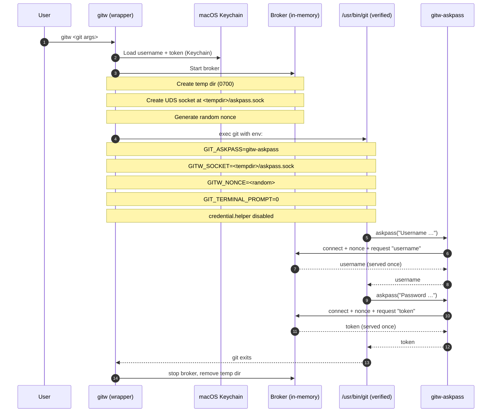

# gitw

[](https://github.com/Martin-Tech-Labs/gitw/actions/workflows/main.yml)
[](https://github.com/Martin-Tech-Labs/gitw/actions/workflows/pr-tests.yml)

Secure Git wrapper for macOS that enforces **GitHub HTTPS-only** and keeps credentials in **Keychain**, while making the wrapped `git` invocation **fail closed**.

---

## What it does

- Enforces **GitHub HTTPS only** (`https://github.com/...`).
- Stores GitHub credentials in the **macOS Keychain**.
- Authenticates via an **in-memory ASKPASS broker** over a **Unix domain socket**.
- Disables Git credential helpers and forces `GIT_TERMINAL_PROMPT=0` (**fail closed**).
- Runs **only** `/usr/bin/git` and verifies its **code signature** against a baked-in requirement.

---

## Threat model (short)

This project is designed for setups where:

- The user running automation (e.g. an “agent” account) is **not fully trusted**.
- The install location (e.g. `/usr/local/bin`) is **admin/root-owned**.

Non-goals:

- If **admin/root is compromised**, all bets are off.

---

## Quickstart

### Build

Development build:

```bash
swift build -c release
```

Release build (auto-pins askpass hash, no manual copy/paste):

```bash
./scripts/release-build.sh
```

Outputs:

- `.build/release/gitw`
- `.build/release/gitw-askpass`

### Install (recommended)

```bash
sudo install -m 0755 .build/release/gitw /usr/local/bin/gitw
sudo install -m 0755 .build/release/gitw-askpass /usr/local/bin/gitw-askpass
```

They must live in the **same directory**.

### First-time login

```bash
gitw login https://github.com/OWNER/REPO.git
```

### Use it like git

```bash
gitw clone https://github.com/OWNER/REPO.git
gitw fetch
gitw push
```

---

## Tests

Run locally:

```bash
swift test
```

What’s covered (high level):

- **Askpass broker (UDS) behavior**
  - Requires the per-run nonce (wrong nonce => no response)
  - Serves username then token once
  - Closes and unlinks the socket after both secrets are served
- **Integrity / hardening checks**
  - Exercises the `/usr/bin/git` resolution path
  - Ensures askpass SHA-256 pinning fails closed on mismatch

Notes:
- Socket tests use `/tmp` to keep Unix-domain-socket paths under the `sockaddr_un` limit.

---

## Security model (how auth works)

Git’s HTTPS auth model is awkward if you want *both* security and a non-interactive UX:

- We want **no interactive prompts** (so automation fails closed).
- We want **no credential helpers** (so Git doesn’t spill secrets to disk/Keychain through helpers).
- We don’t want tokens passed in argv or written to files.

`gitw` uses Git’s supported `GIT_ASKPASS` mechanism, but **without** letting the askpass helper read Keychain.
Instead, `gitw` runs a short-lived *in-memory credential broker* and `gitw-askpass` talks to it over a Unix domain socket.

### Sequence (high-level)



### What’s on disk vs in memory

- **On disk:** a temporary directory and a Unix domain socket *file* (IPC endpoint).
  - No token is written to disk.
- **In memory:** the broker holds the username/token briefly for the lifetime of the invocation.
- **At rest:** credentials live only in the macOS Keychain.

---

## Integrity checks

### `/usr/bin/git` code signature policy

`gitw` runs **only** `/usr/bin/git` and requires it to satisfy a baked-in code-signature requirement.

To inspect the designated requirement for a binary:

```bash
codesign -dr - /usr/bin/git 2>&1
```

### Askpass hash pinning

If an attacker can replace the `gitw-askpass` binary on disk, they could steal credentials.
To fail closed, `gitw` computes the **SHA-256** of the installed `gitw-askpass` and compares it to the hardcoded expected hash.

Operational note:
- Rebuilding `gitw-askpass` changes the hash.
- Use `./scripts/release-build.sh` to regenerate and embed the correct hash automatically.

---

## Environment variables

None (deliberate security choice).

---

## Limitations

- Intentionally restrictive: GitHub-over-HTTPS only.
- `gitw` validates arguments it can see, but Git has complex subcommands and config layers—keep your repos clean.
